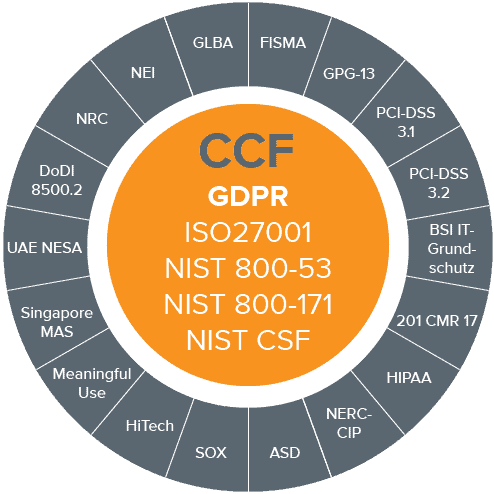

******************************************************
Standards and Compliance Docs
******************************************************

Compliance
====================

This topic deserves a conversation if "compliance" is a relevant topic. A seasoned compliance writer radically reduces the engineering and management burden though an understanding of how compliance frameworks have evolved from common ISO and regulatory standards. Many of the control buckets are identical. "Change control" docs, for example, may be identical across FEDRamp, CC, PCI, and so on. Moreover, achieveing compliance and certification often centers on *documenting what you already do* rather than *changing what you do*. An awareness of the distinction can save an organization hundreds, if not thousands, of hours.

* 2021 Acrobat Sign: FEDRamp: Authored all engineering SOPs for 217 controls. Created a diagram library
* 2018: Echosign: HIPPA, PCI certification (SOPs + all network and process diagrams)
* 2009: Acrobat Common Criteria certification. Sole writer
* 2009: Acrobat compliance with EU/German digital signature laws. Digital signature algorithms and encryption docs.

.. note:: Video on request

Standards docs
=======================

* 2022: Align Acrobat and PDFL SDKs with the ISO PDF standard. 
* 2020-2022: Home pages for PDF, SVG, XMP specs, manage go URL library and cross doc linking across 20,000 pages. 
* 2018: FTPDF language specification (Liquid Mode in PDF): Sole author on a team of contributing engineers. The original intent was to provide an extensions to the ISO specification. 
* 2008: Co-authored Dynamic PDF specification (a compound document format) for W3C submission. After one year, the DPDF project morphed into AIR after Adobe bought Macromedia and owned Flash. 
