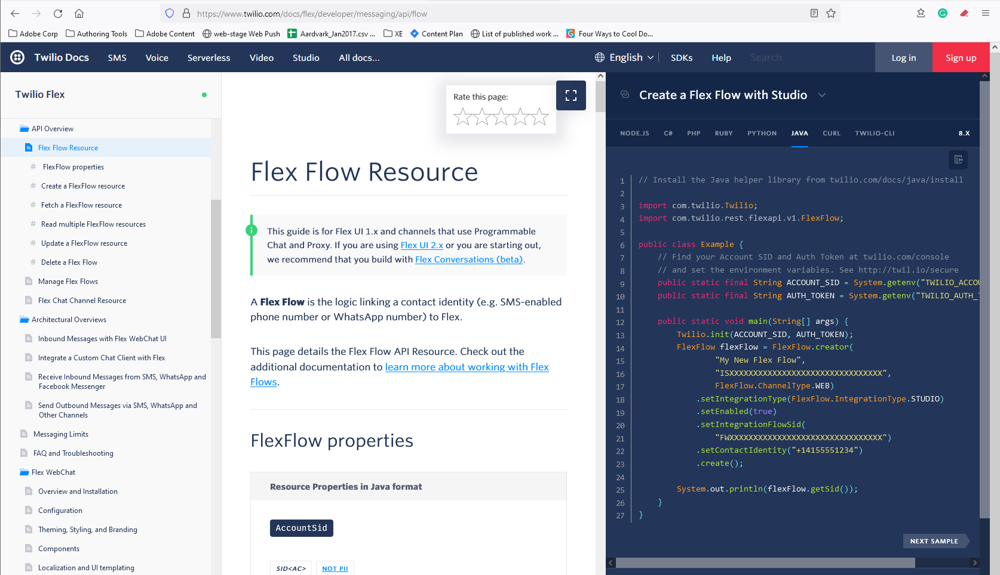

******************************************************
Cutting Edge Developer Docs
******************************************************

One of my current projects is a Twilio-like developer doc framework. Developers and content managers around the global recognize Twilio as a leader in developer-friendly docs. Even a `cursory glance <https://www.twilio.com/docs/flex/developer/messaging/api/flow>`_ demonstrates Twilio's success at achieving usability and simplicity. 

I believe it's possible to improve on this model, and I'm using Hugo to do it. New features should include: 

* A third column that can be toggled on/off
* Better search UI placement 
* Better search with highlighting
* Doc level search as well as content library search
* More clear presentation of page-level vs. content-level controls
* Developer/user controls for: 

  * Themes
  * Hiding UI items (for example, hiding text when they only want to see code)
  * Switching code vs text columns

Publish pipeline features should include: 

* GIT management (e.g auto go-live on push to master)
* Scripted builds
* Automatic consumption of code files (so author does not copy/cut/paste into docs)
* Localization support

