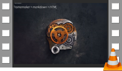
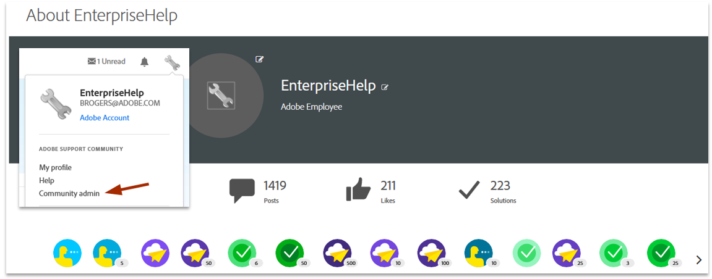

.. |test| unicode::  `_
* `Acrobat Deployment Guide <https://www.adobe.com/devnet-docs/acrobatetk/tools/DesktopDeployment/index.html>`_
* `Desktop Virtualization Guide <https://www.adobe.com/devnet-docs/acrobatetk/tools/VirtualizationGuide/index.html>`_
* `Acrobat Macintosh Admin Guide <https://www.adobe.com/devnet-docs/acrobatetk/tools/AdminGuide_Mac/index.html>`_
* `Registry and plist Reference <https://www.adobe.com/devnet-docs/acrobatetk/tools/PrefRef/Windows/index.html>`_. XML Db with an XSL-generated HTML front end.
* `Application Security Guide <https://www.adobe.com/devnet-docs/acrobatetk/tools/AppSec/index.html>`_
* `Digital Signatures Guide <https://www.adobe.com/devnet-docs/acrobatetk/tools/DigSigDC/index.html>`_
* `Customization Wizard Guide <https://www.adobe.com/devnet-docs/acrobatetk/tools/Wizard/index.html>`_
* `Utilities and tools <https://www.adobe.com/devnet-docs/acrobatetk/tools/Labs/index.html>`_

Enterprise Support
============================

Engaging enterprise support is one of my priorities. I've been a primary contributor/resource on external and internal forums for 15 years. 

Example: Field support
========================================

   Mapping registry configs to the app UI

Forum administration
=========================

* Created 3 mobile app forums and 3 enterprise/admin-only forums. 
* Administered/managed 6 forums for 8 years. 
* Answered 30% of all enterprise deployment and workflow questions. 
* Continue to the act as a primary resource for field sales and enterprise support. 

* `Customization Wizard (in-product and online) <https://www.adobe.com/devnet-docs/acrobatetk/tools/Wizard/index.html>`_
* `Acrobat digital signatures <https://www.adobe.com/devnet-docs/acrobatetk/tools/DigSigDC/index.html>`_. This content is old but continues as the primary digsig resource. 
* 20+ other in product, context sensitive help systems for 4 companies.
* Acrobat.com: A proposal for an online help system (before it existed).

.. raw:: html

    

