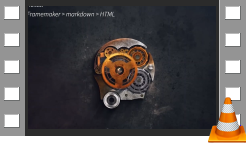
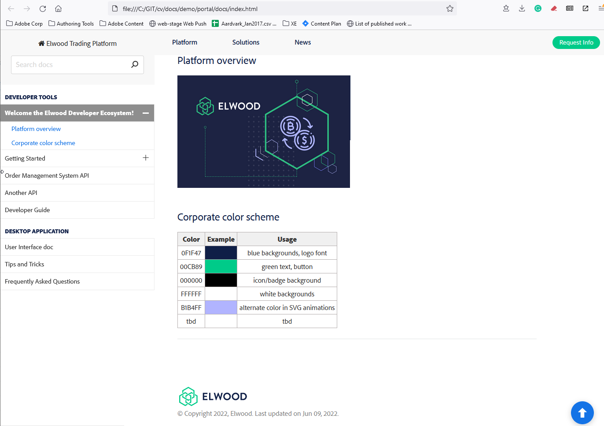
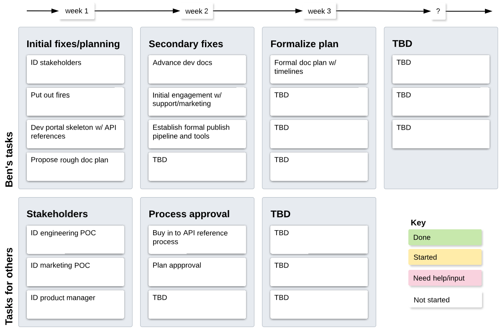
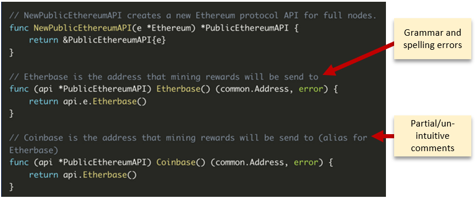
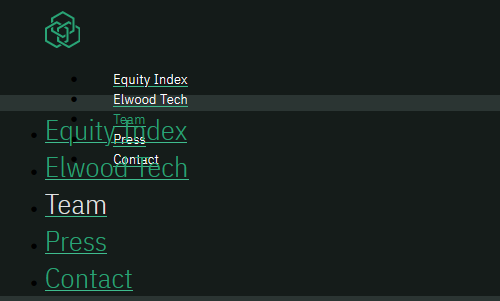
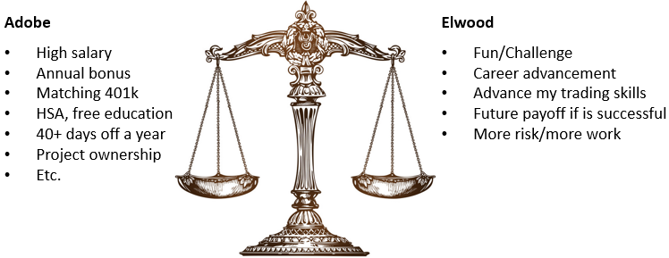
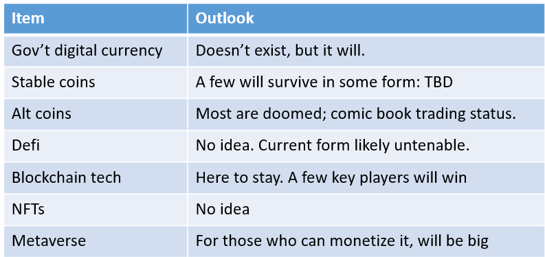

******************************************************
Introduction
******************************************************

.. note:: This document is in progress.

**Overview**

.. list-table:: 
    :widths:  25 75
    :header-rows: 1

    * - Item
      - Details
    * - Years experience
      - 20+
    * - Startups
      - 3
    * - Large Enterprise
      - Many, including Adobe.
    * - Pages currently under my ownership
      - 20,000+
    * - Current page views
      - Over 11,000,000 per year for docs I author.
    * - User Interface doc
      - Too many to count. Expert level. Desktop, web, and mobile apps, context sensitive help, MS Help, Webworks, Sphinx.
    * - SDKs and developer portals
      - 10+ Expert level. Adobe, AIR, Adobe Connect, DC Services, DC View, Acrobat, PDFL, Knowmadic, Escalate, Avantgo
    * - API References
      - Too many to count. Expert level. Dozens of projects using Javadoc, Doxygen, Swagger, Sphinx.
    * - Developer Guides
      - Too many to count. Expert level. 
    * - Enterprise docs
      - Too many to count. Expert level. Deployment and config docs for dozens of desktop and service-based products. 
    * - Specifications
      - Expert level. Internal and external implementation, language, and security specs.
    * - Compliance docs
      - Expert level. HIPPA, SOC, PCI, FEDRamp, Common Criteria. No experience in Fintech.
    * - Whitepapers, data sheets
      - Competent level. Too many to count. Domain expertise is required to reach an expert level.
    * - Scripting, automation
      - Expert level for a writer. See video. I'm neither an engineer nor a web developer. 

A doc team's role
================================

Stakeholder communication: My take on how writers should interact with other content stakeholders.

   A writer's relationship to content stakeholders

Doc roadmap for Elwood
===========================

Guidance and direction is awesome, but it's not required. I can rapidly ramp with as little as 4 manager POCs: engineering, product management, marketing management, support. You can set priorities, or the first week could look like this: 

* Triage emergencies
* API references live + skeleton developer portal
* Propose a rough documentation strategy

Performance expectations
----------------------------

* Dev portal skeleton: 1 day to build, 1 day to brand, 3 days for review and updates. Assume continuous evolution.
* API References: 1-2 days to brand; 1 day per 100 API code comment updates. Integrate with dev portal: PDQ.
* Dev Guides: Intro, dev env, system reqs, getting a credential: 2 days; Other topics: highly variable. Integrate with dev portal: instantaneous.
* User interface docs: 

   * New publish methodology, including migrating current content to a scalable method: unknown, but fast. 
   * Pages per day: Could start out at 2-5 per day and ramp to 10/day; however, I haven't seen the product so it's a guess.
   * Note that UI docs are often the easiest to produce, but there are often workflow constraints which impair speed to go-live. 

.. caution:: It doesn't auto-magically happen all at once. Requirement: prioritize.

This mockup took 1 hour
------------------------

Click the image or: `Doc portal mockup <./demo/portal/docs/index.html>`_

Typical rough plan
--------------------------

.. note:: Just one possibility of course. 

Immediate fixes?
--------------------

API Ref cleanup: Link, brand, edit/expand comments.

Remove this page: https://elwoodam.io/team

Relevant questions
==========================

.. raw:: html

            

              <h3 class="accordionheading">Why would you leave your world-class job?</h3>

.. raw:: html

              <h3 class="accordionheading">What are your weaknesses?</h3>

* **Marketing docs**: I've written many whitepapers, but it's a slow slog relative to domain experts. I'm more effective as a reviewer and technical liaison between engineering and marketing teams. 
* **Coding from scratch**: I'm not an engineer or web developer, but hey, I only need to push strings around. . .
* **Graphic art**: I'm an expert at screenshots, workflow and network diagrams, quick keys, and so on. I'm not a graphic artist and don't use Illustrator, Photoshop, or other raw vector/raster image editing programs. If I need icons, for example, I grab an open source library.
* **Politics**: I'm marginal at sugar-coating bullshit. I speak my mind. 
* Be clear about your expectations, and I'll be honest about my capabilities. There's no point in accepting a position in which I cannot excel.

.. raw:: html

              <h3 class="accordionheading">How do you feel about travel?</h3>

* Like it.
* Traverse City, Michigan is 2 hours via a direct flight to NY. 
* I visit Europe once or twice a year as my wife is Hungarian: UK visits are fine.
* Note that I maintained an apartment in San Jose for two years *at my own expense* and paid for 2 out of 3 air tickets per quarter. Adobe provided an office for 8 years, but my primary POCs are in India, Boston, and Seattle, so the ROI diminished over time.
* I actually like showing up at an office--though I will not relocate.
* Remote workers are a double-edged sword. If I was building a writing team, I would start with part time contractors. 

.. raw:: html

              <h3 class="accordionheading">What's your interest level in the job?</h3>

* If I'm confident in my success, high. I'm guessing what Elwood needs: API refs, dev guides, dev portal, UI/app docs, a process and tooling with a plan. Despite having strong coding skills *for a writer*, I'm neither an engineer nor a web developer. 
* I need to know what you're building, who your customers might be, and why you think Elwood will thrive in a world with Aladdin, Bloomberg terminal, TOS, and other mature players.
* There's a crypto-verse shakedown in progress. Could be just starting. What is Elwood's strategy?

.. raw:: html

            

              <h3 class="accordionheading">What is your outlook for Crypto?</h3>

