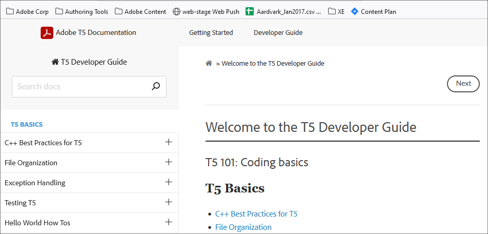
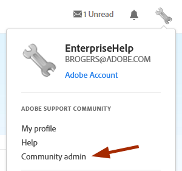
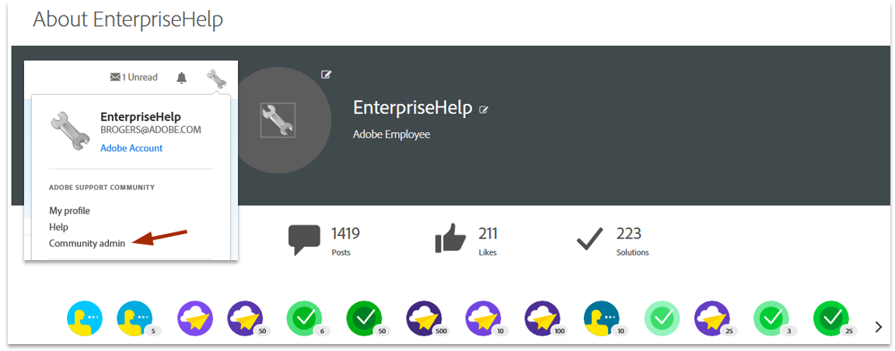
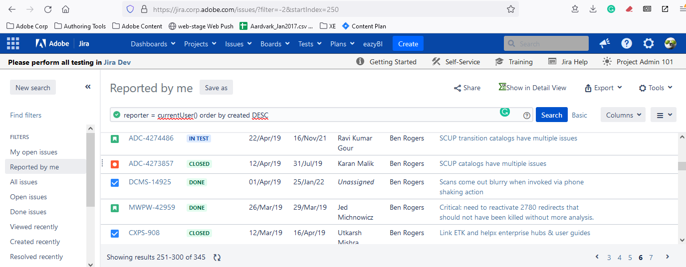

******************************************************
Special Projects
******************************************************

.. figure:: images/uc3.gif
   :scale: 50%

   Under construction

Some example docs and projects. 

Developer
================

T5: Microsoft/Adobe partnership
-----------------------------------------

Docs include a dev guide, API reference, and release notes. Internal project. 

Acrobat and PDFL developer guides
---------------------------------------

* 2022: Migrate  Acrobat and PDFL developer guides to the web: 3700 pages of Framemaker binary files to HTML.
* Scripted process: JSX > LUA/Pandoc > Python/REGEX to HTML.
* Programmatically create PDF for collaborative review. 
* Content: *not updated yet* but I have started removing duplication and improving usability. 
* Align API docs with the ISO PDF standard. 

.. figure:: images/videoicon.png
   :target: https://drive.google.com/file/d/1d15uzX_zYl2sBx9iV4Whlq4TYzj6sXb8/view?usp=sharing

   Scripted conversion of binary files to HTML

Adobe Sign dev ecosystem overhaul
----------------------------------------

* Overhaul the entire dev ecosystem: Content is 7 years stale. 
* There is no product manager or marketing owner. 
* Scope all assets and coordinate with Director of Engineering on the proposed plan. 
* **Done**: `Migrated content to a new pipeline <https://opensource.adobe.com/acrobat-sign/developer_guide/>`_, upgraded the UI, and rewrote the intro/images. In progress.

Publish pipeline and process
=======================================

Management proposal: Why use markdown?
---------------------------------------

Rationale:

* Boost productivity up to 500%
* Scriptable
* Native OS features 
* Free and open source tools

.. figure:: images/videoicon.png
   :target: https://drive.google.com/file/d/1kOjTVZ-kfHLYH_Iov414xUTFsjxl0Shk/view?usp=sharing

   Markdown at Adobe

Global replace for GIT-markdown pipelines
--------------------------------------------------------

.. figure:: images/videoicon.png
   :target: https://drive.google.com/file/d/1djuZT5wjjn-GcRfLriF1WllBo5HlpH9V/view?usp=sharing

   How-to for content managers

Enterprise configuration and deployment 
==========================================

* `Acrobat Admin Guide <https://www.adobe.com/devnet-docs/acrobatetk/tools/AdminGuide/index.html>`_
* `Acrobat Deployment Guide <https://www.adobe.com/devnet-docs/acrobatetk/tools/DesktopDeployment/index.html>`_
* `Desktop Virtualization Guide <https://www.adobe.com/devnet-docs/acrobatetk/tools/VirtualizationGuide/index.html>`_
* `Acrobat Macintosh Admin Guide <https://www.adobe.com/devnet-docs/acrobatetk/tools/AdminGuide_Mac/index.html>`_
* `Registry and plist Reference <https://www.adobe.com/devnet-docs/acrobatetk/tools/PrefRef/Windows/index.html>`_. XML Db with an XSL-generated HTML front end.
* `Application Security Guide <https://www.adobe.com/devnet-docs/acrobatetk/tools/AppSec/index.html>`_
* `Digital Signatures Guide <https://www.adobe.com/devnet-docs/acrobatetk/tools/DigSigDC/index.html>`_
* `Customization Wizard Guide <https://www.adobe.com/devnet-docs/acrobatetk/tools/Wizard/index.html>`_
* `Utilities and tools <https://www.adobe.com/devnet-docs/acrobatetk/tools/Labs/index.html>`_

Enterprise Support
============================

Example communication with the field
----------------------------------------------------------

.. figure:: images/videoicon.png
   :target: https://drive.google.com/file/d/1jPrGEz5Vsx2B_uGrwcyj09AJOBVjZ1kz/view?usp=sharing

   Mapping registry configs to the app UI

Forum administration
-------------------------------------

* Created 3 mobile app forums and 3 enterprise/admin-only forums. 
* Administered/managed 6 forums for 8 years. 
* Answered 30% of all enterprise deployment and workflow questions. 
* Continue to the act as a primary resource for field sales and enterprise support. 

Bugs
=========================

As user interface and string experts, writers should file bugs. If writers understand the product, they can prove it by participating in the development process. Product expertise is a baseline requirement.

User interface & string work
======================================

* Design live HTML mockups and proposals: 
  
  * iReader: `Mobile and desktop UI mockup 2016  <./demo/iReader/index.html>`_ (**Check out the live Acrobat mobile app!**)
  * Product features search: `Proposal to help users find Acrobat tools (2016) <./demo/findme/index.html>`_
  * Super tips: `2017: A better in-product help experience <./demo/SuperTips/start.html>`_

* Continuously provide usability feedback and file enhancement bugs
* Edited 2000 UI strings over the course of Acrobat's last 15 years 
* Authored most of Acrobat and Reader's security-related strings from 2009-2018

Standards docs
=======================

* 2022: Align Acrobat and PDFL SDKs with the ISO PDF standard. 
* 2020-2022: Home pages for PDF, SVG, XMP specs, manage go URL library and cross doc linking across 20,000 pages. 
* 2018: FTPDF language specification (Liquid Mode in PDF): Sole author on a team of contributing engineers. The original intent was to provide an extensions to the ISO specification. 
* 2009: Hired at Adobe to co-author the DPDF (dynamic PDF) language spec. After one year, the project morphed into AIR after Adobe bought Macromedia and owned Flash. 

Specifications
=====================================

* FTPDF Specification (Liquid Mode in Acrobat)
* Security: Yellow Message Bar Specification
* Adobe Cross Domain Policy Specification
* Registry preference implementation specification for engineering
