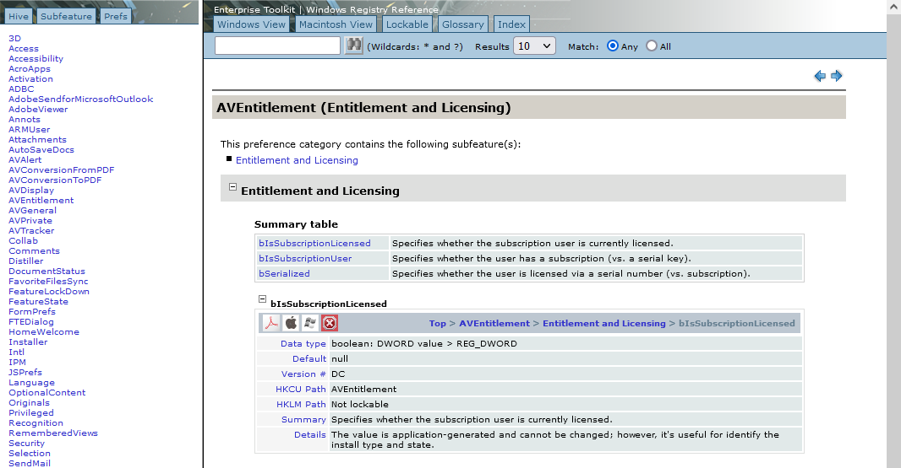

.. |test| unicode::  `_ for configuring enterprise desktop deployments. This document remains the world's leading registry reference and provides features not found in any other Fortune 500 enterprise registry document. 

The document's source is an XML data set. I used XSL to create the HTML, and I transformed the data into a usable UI by providing several alternate data views. I then added features to the views, and the result is a popular tool that sees 500k views a year by Adobe Acrobat admins deploying and configuring their desktop apps. 

Features include: 

* Win and Mac views
* Views by hive, subfeature, and key
* Sortable index view by product, security, user config, lockability (in HKLM) and so on
* Search engine with highlighted results
* Previous and next buttons
* Tooltips

I created the following video for Adobe's Solutions Consultants. It provides a brief overview and also demonstrates a method for mapping registry entries to the product user interface. 

.. figure:: images/videoicon.png
   :target: https://drive.google.com/file/d/1jPrGEz5Vsx2B_uGrwcyj09AJOBVjZ1kz/view?usp=sharing

