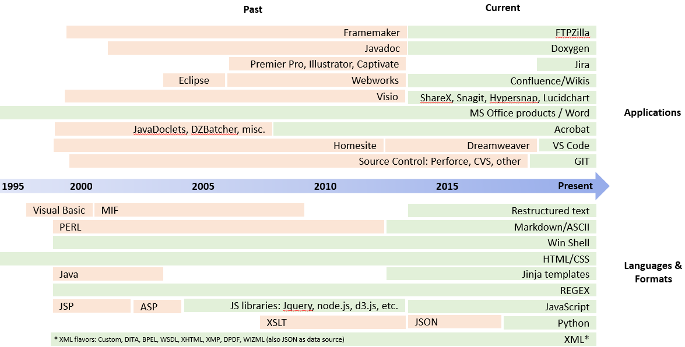

******************************************************
Tools, Languages, Formats
******************************************************

Skills evolve and even whither. 15 years ago I was a Framemaker and Perl wiz. At that time I built a UI in Perl/Tk for programmatically interacting with Frame files. Do I remember those skills now? No. Nine years ago I wrote an XSL/HTML front end for an XML db--it remains the slickest `Registry Reference <https://www.adobe.com/devnet-docs/acrobatetk/tools/PrefRef/Windows/index.html>`_ on the internet, but could I tell you how I wrote those thousand lines of XSL today? Not likely. However, the point is we all should adapt to the task at hand and--over time--become versatile and tool saavy. My skills-du-jour are currently Python/regex/HTML. 

Please note the following: 

* My coding skills are high relative to other technical writers--but low relative to engineers.
* I can programmatically push strings around all day long and make JS widgets tap dance on the web, but I leverage the web (e.g. StackOverflow) and open source libraries--I'm not writing functions from scratch.

Application and language experience
===========================================

Scripting and automation overview
====================================

.. figure:: images/videoicon.png
   :target: https://drive.google.com/file/d/1hwRVC1HwAcGfhrQjLUPY16R88ltenQGD/view?usp=sharing

   Brief synopsis of Ben's coding skills

.. raw:: html

   <!--

    What should an SDK content owner know?
    ============================================

    If you think an SDK author should be able to read your code, you're wrong. It's true a writer should have the skills to follow objects across functions, write code comments, push to source without breaking anything. But a writer's ultimate value rests with tasks such as: 

    * Setting up the *branded* API Reference and Dev Guide pipelines
    * Transforming a code comment sphaghetti monster into a butterfly
    * Off loading mundane engineering tasks to speed development
    * Recognizing when engineering specs are needed and even writing them 
    * Proposing and building tools that help dev customers
    * Acting as a liasion to between engineering and both marketing and customer support (again: to reduce the burden on engineering)
    * Creating architecture and workflow diagrams
    * Etc. 

    At the end of the day, comprehending the 10,000' view certainly provides more value than knowing what's happening at the function-level.

  -->