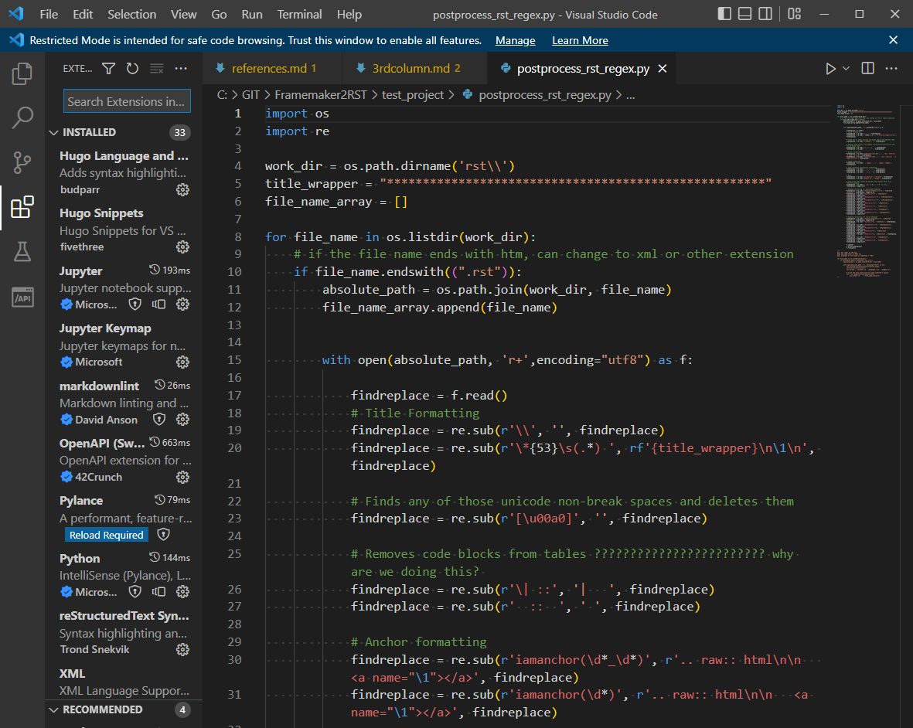

******************************************************
Tools, Languages, Formats
******************************************************

.. image:: images/evolve.png

Skills evolve and even whither. 15 years ago I was a Framemaker and Perl wiz. At that time, I crafted a UI in Perl/Tk for programmatically interacting with Frame files. Do I remember those skills now? No. Nine years ago I wrote an XSL/HTML front end for an XML db--it remains the slickest `Registry Reference <https://www.adobe.com/devnet-docs/acrobatetk/tools/PrefRef/Windows/index.html>`_ on the internet, but could I tell you how I wrote those thousand lines of XSL today? Not likely. However, the point is workers should adapt to the task at hand and--over time--become versatile and tool savvy. My skills-du-jour are currently Python/regex/HTML. 

Please note the following: 

* My coding skills are high relative to other technical writers--but low relative to engineers.
* I can programmatically push strings around all day long and make JS widgets tap dance on the web, but I leverage the web (e.g. StackOverflow) and open source libraries--I'm not writing functions from scratch.

Scripting and automation overview
====================================

.. figure:: images/videoicon.png
   :target: https://drive.google.com/file/d/1hwRVC1HwAcGfhrQjLUPY16R88ltenQGD/view?usp=sharing

   Brief synopsis of Ben's coding skills

Application and language experience
===========================================

.. image:: images/skills.png

Visual Studio Code
=========================

  I discovered VSC in 2020 and dropped a dozen other tools. Most of my work happens in VSC. 

